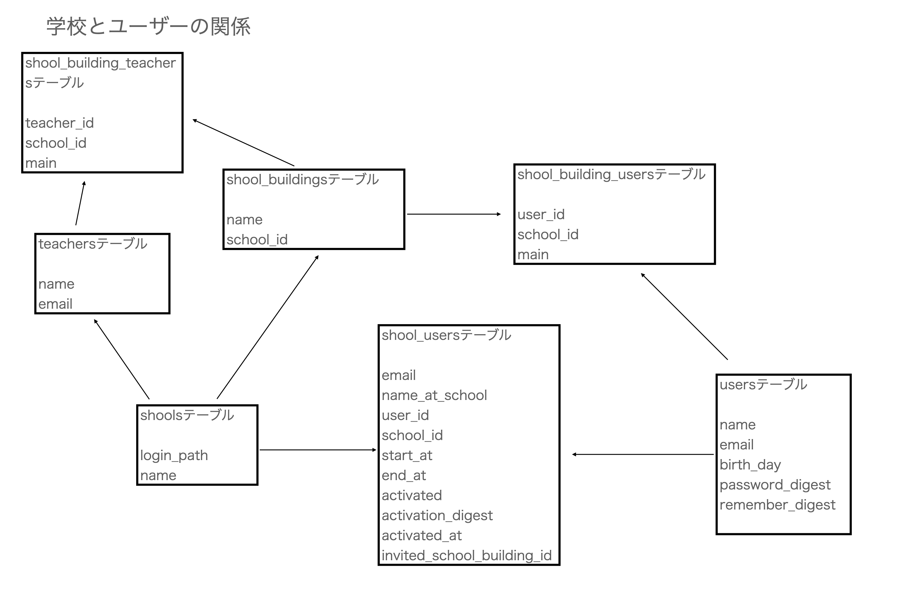
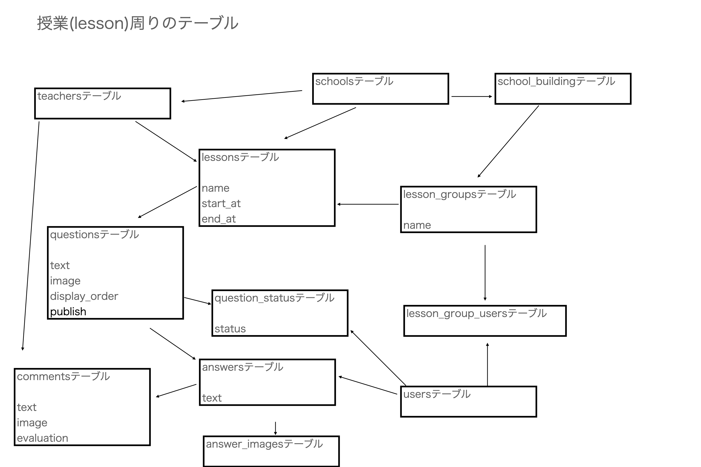
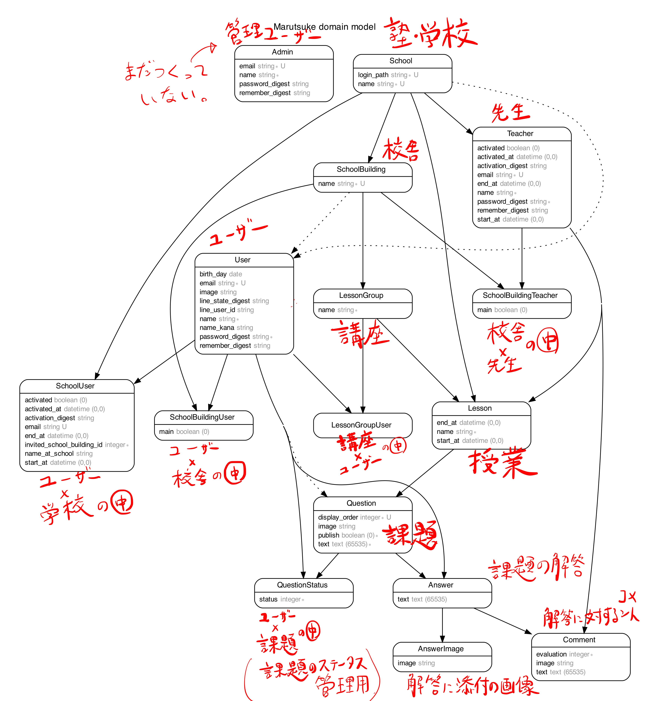

# README

# AppName : Marutsuke

# environment

### Rails 6.0.3

### ruby 2.7.1

# Overview

## 宿題を提出・授業中の課題を写真で投稿でき、教員が管理することができるアプリ

## 目指すべきサービス像

### ・シンプルなデザイン・UI

### ・セキュリティー

### ・必要十分な機能性

### ・生徒の提出物に評価・コメントができる

## 生徒にできること

### ・課題の提出

### ・教員からの評価を受け取る

# ER 図 (ユーザー・教員周り 2020/8/22)

# ER 図 (授業・ユーザー周り 2020/8/22)

# ER 図自動生成(2020/10/18)

