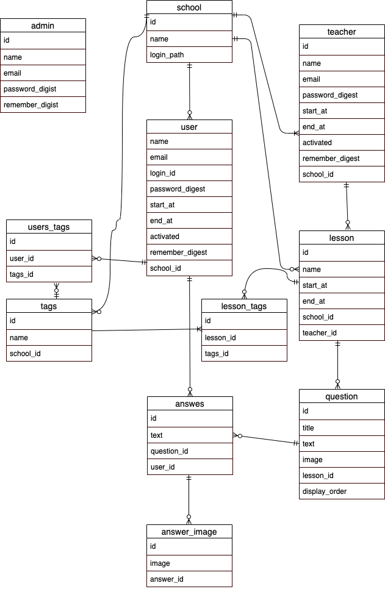
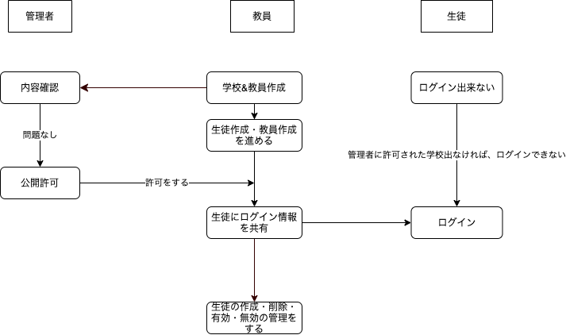
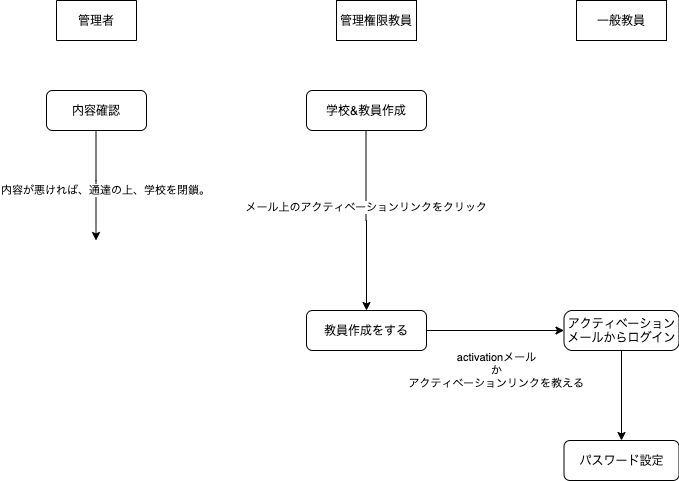
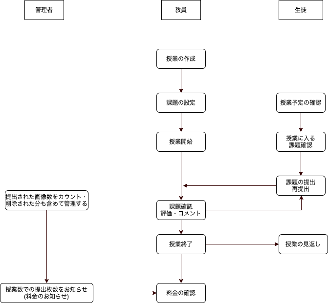

# README

# AppName : Marutsuke

# environment

### Rails 5.2.3

### ruby 2.6.3

# Overview

## 宿題を提出・授業中の課題を写真で投稿でき、教員が管理することができるアプリ

## 目指すべきサービス像

### ・シンプルなデザイン・UI

### ・セキュリティー

### ・必要十分な機能性

## 教員にできること

### ・教員の作成

### ・生徒の作成

### ・授業の作成・設定

### ・授業の課題の設定

### ・生徒の提出物に評価・コメントができる

## 生徒にできること

### ・課題の提出

### ・教員からの評価を受け取る

# フロー図

# ER 図 (2020/6/13 現在)

## ログイン・サインアップフロー

## 学校&教員作成フロー(6/20)

## レッスンフロー

